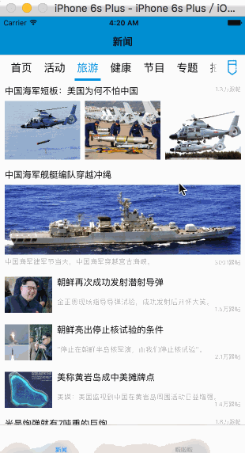

# DDNews
模仿网易新闻/凤凰新闻做的简单demo。
网易的接口，抓的有点凌乱。

## ScrollView + CollectionView 完成主界面
滑动新闻表格时，上面分类列表跟随切换，下划线实时跟随滚动。  
切换时两个label之间的颜色有渐变效果。  
分类排序界面用了LXReorderableCollectionViewFlowLayout。  

## 图片浏览
支持双击缩放、捏合缩放。  
切换时的效果用了JT3DScrollView。  
简介文本写的有点凌乱，还是网易写得好，凤凰的在上下拖动时有些问题。  
开始用ScrollView实现了简介文本的拖动，有点小问题，就换成了手势。  

